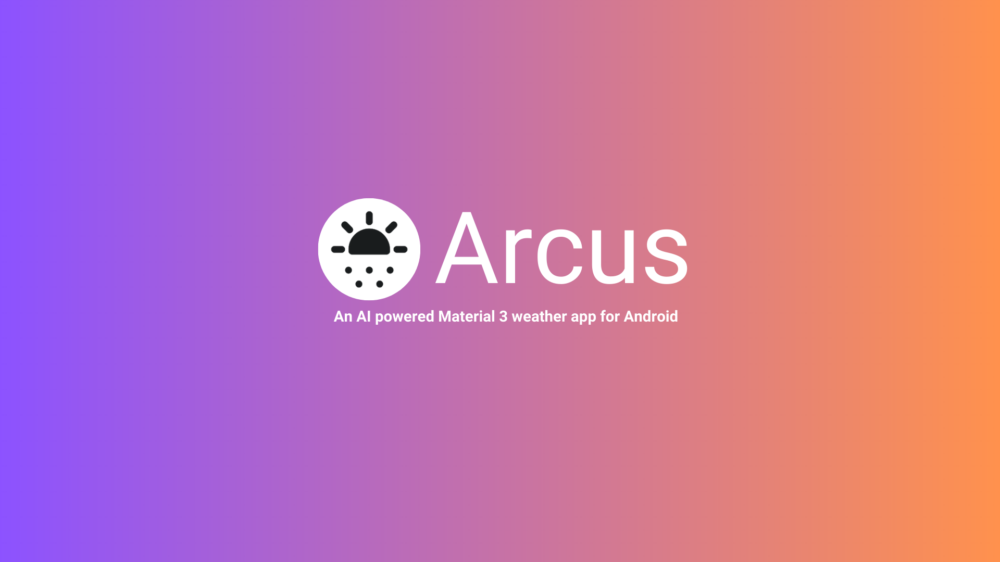
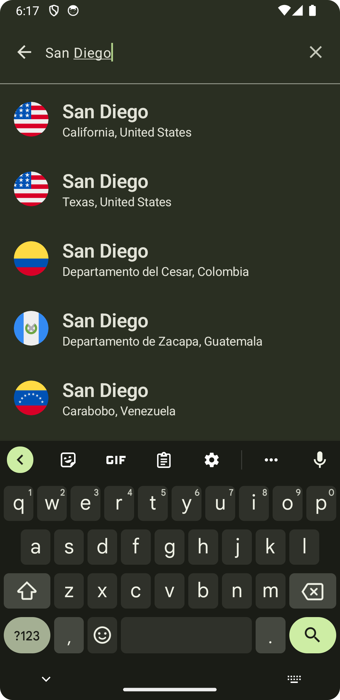

# Arcus - AI powered Material 3 Weather App for Android

<p align = "center">
    <a href="https://www.repostatus.org/#active"></a>
</p>

Arcus is a simple weather app built completely with Jetpack Compose. Under the hood, it uses the [Open-Meteo Weather API](https://open-meteo.com) to fetch the data. It also uses the [OpenAI API](https://openai.com/blog/openai-api) to display a short whimsical summary of the current weather of a particular location. This app uses the Material 3 design system and also supports dynamic colors on supported devices. 

## Table of contents
1. [Demo](#demo)
2. [Screenshots](#screenshots)
3. [Tech Stack](#tech-stack)
4. [Remote API's](#remote-apis)
5. [Notable Features](#notable-features)
6. [Themed App Icon](#themed-app-icon)
7. [Source code, Architecture, & Testing](#source-code-architecture--testing)
8. [Building and running the app](#building-and-running-the-app)
## Demo
https://github.com/t3chkid/Arcus/assets/54663474/a7247543-afc8-4761-92b7-f8b002819380

## Screenshots
 &nbsp;  &nbsp;  

## Themed App Icon
The app also supports the "Themed Icons" feature available on Android 13 and later. If the user has opted in for the feature on a device that is running Android 
13 and higher, the app's icon will be tinted to inherit the coloring of the user’s chosen wallpaper and other themes.

<table>
  <tr>
    <td>  </td>
    <td>  </td>
    <td>  </td>
  </tr>
</table>

## Tech Stack
- Entirely written in [Kotlin](https://kotlinlang.org/).
- [Hilt](https://www.google.com/url?client=internal-element-cse&cx=000521750095050289010:zpcpi1ea4s8&q=https://developer.android.com/training/dependency-injection/hilt-android&sa=U&ved=2ahUKEwiW5omeu6z4AhWRR2wGHVUsCo0QFnoECAMQAQ&usg=AOvVaw3dCbP79C6od3KVCnJub3v0) for dependency injection.
- [Jetpack Compose](https://developer.android.com/jetpack/compose) for UI and navigation.
- [Coil compose](https://coil-kt.github.io/coil/compose/) for image loading and caching.
- [Coil-gif](https://coil-kt.github.io/coil/gifs/) for loading and displaying gif's.
- [Coil-svg](https://coil-kt.github.io/coil/svgs/) for loading and displaying svg's from URL's.
- [Accompanist Placeholder](https://github.com/google/accompanist/tree/main/placeholder-material3) for adding shimmer animation when loading an image. 
- [SplashScreen API](https://developer.android.com/develop/ui/views/launch/splash-screen) for displaying a splashscreen in a backwards compatible way.
- [Kotlin Coroutines](https://kotlinlang.org/docs/reference/coroutines/coroutines-guide.html) for threading.
- [Kotlin Flows](https://developer.android.com/kotlin/flow) for creating reactive streams.
- [Mokito-Kotlin](https://github.com/mockito/mockito-kotlin) for mocking dependencies in unit tests.
- [Retrofit](https://square.github.io/retrofit/) for communicating with the Open-Meteo API.
- [Room](https://developer.android.com/training/data-storage/room) for database.
- [Java 8 Date/Time API](https://www.oracle.com/technical-resources/articles/java/jf14-date-time.html) for dealing with date and time.
- [Timber](https://github.com/JakeWharton/timber) for logging.
- [Work Manager](https://developer.android.com/topic/libraries/architecture/workmanager?gclid=EAIaIQobChMIwJy33ufG8QIVGcEWBR31Mwa-EAAYASAAEgIF3vD_BwE&gclsrc=aw.ds) for background tasks.
- Moshi + Moshi Kotlin CodeGen for deserializing responses from the API.
- Google play location services for getting the user’s location.

## Remote API's
- [Open-Meteo weather api](https://open-meteo.com) for fetching weather information.
- [OpenAI API](https://openai.com/blog/openai-api) for generating a short, whimsical summary of the current weather of a particular location.

## Notable Features

<dl>
  
  <dt> Adaptive UI based on permissions 🪄</dt>
  <dd> The main permission that this app needs is the location permission. The UI of the app adapts based on whether the location permission is granted or not. If it is granted, the weather for the user’s current location would be displayed directly in the Home Screen. If it is not, that portion of the UI would simply not be displayed, ensuring that the UX is not undermined even if the user chooses to not provide the location permission. </dd>
    
  <dt> Themed splash screen 🎨</dt>
  <dd> In Android 12 and above, the background color of the splash screen matches the system theme. This minor detail, unique to this app, helps in improving the synergy of the app, with the rest of the system, from the moment the app is launched.  </dd>
    
  <dt> Error handling ⚠️ </dt>
  <dd>When an error is encountered, the app ensures that it displays an appropriate error message and also provides a way to retry the operation that caused the error to occur.</dd>

</dl>
  

## Source code, Architecture, & Testing
- All concrete implementations are prefixed by the term “Arcus”.
- Uses multi-repository pattern.
- MVVM architecture.
- Each package is considered as an individual module / submodule. Most notably, the data "module" is ensured that it is considered as a separate module
  and is ensured that it doesn't depend upon any other "modules" in the upper layers of the architecture.
- Commit messages follow the [Conventional Commits](https://www.conventionalcommits.org/en/v1.0.0/) specification.
- Consists of extensive unit tests with a predominant focus on testing the data layer.
- All api methods that use the “get” procedure under the hood, have the word “get” as the prefix of the method name. All repository methods that fetch some data have the prefix “fetch” in the name of the method. This way, api specific terminologies like “get” and “post” are abstracted away from the clients of the repositories.

## Building and running the app
1. Create an [Open-AI developer account](https://openai.com/blog/openai-api) and generate an API token.
2. Add the API token to the `local.properties` file of your project in the following manner.
```properties
OPEN_AI_API_TOKEN = PASTE-YOUR-TOKEN-HERE
```
3. Build the project and run the app on an emulator or physical device.
