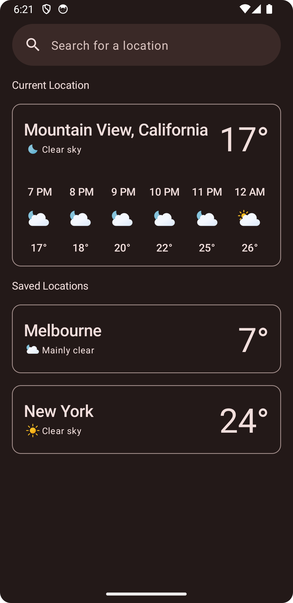
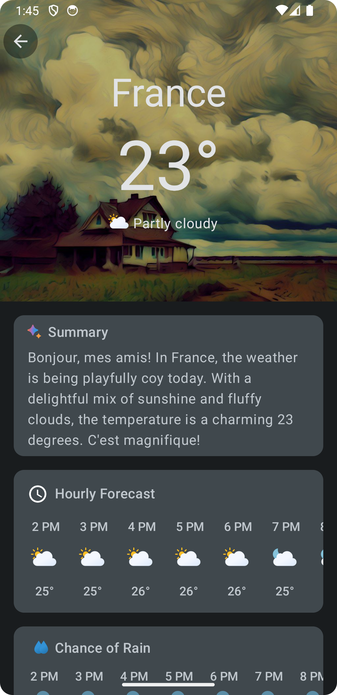

# Arcus - A Material 3 Weather App for Android

Arcus is a simple weather app built completely with Jetpack Compose. Under the hood, it uses the [Open-Meteo Weather API](https://open-meteo.com) to fetch the data. It also uses the [OpenAI API](https://openai.com/blog/openai-api) to display a short whimsical summary of the current weather of a particular location. This app uses the Material 3 design system and also supports dynamic colors on supported devices. 

## Table of contents
1. [Demo](#demo)
2. [Screenshots](#screenshots)
2. [Tech Stack](#tech-stack)
3. [API's](#apis)
4. [Themed App Icon](#themed-app-icon)
5. [Source code, Architecture, & Testing](#source-code-architecture--testing)

## Demo
https://github.com/t3chkid/Arcus/assets/54663474/99953e95-c5b8-4b2b-aea6-703eb08a81f8

## Screenshots
 &nbsp;  

## Themed App Icon
The app also supports the "Themed Icons" feature available on Android 13 and later. If the user has opted in for the feature on a device that is running Android 
13 and higher, the app's icon will be tinted to inherit the coloring of the user’s chosen wallpaper and other themes.

<table>
  <tr>
    <td>  </td>
    <td>  </td>
    <td>  </td>
  </tr>
</table>

## Tech Stack
- Entirely written in [Kotlin](https://kotlinlang.org/).
- [Hilt](https://www.google.com/url?client=internal-element-cse&cx=000521750095050289010:zpcpi1ea4s8&q=https://developer.android.com/training/dependency-injection/hilt-android&sa=U&ved=2ahUKEwiW5omeu6z4AhWRR2wGHVUsCo0QFnoECAMQAQ&usg=AOvVaw3dCbP79C6od3KVCnJub3v0) for dependency injection.
- [Jetpack Compose](https://developer.android.com/jetpack/compose) for UI and navigation.
- [SplashScreen API](https://developer.android.com/develop/ui/views/launch/splash-screen) for displaying a splashscreen in a backwards compatible way.
- [Kotlin Coroutines](https://kotlinlang.org/docs/reference/coroutines/coroutines-guide.html) for threading.
- [Kotlin Flows](https://developer.android.com/kotlin/flow) for creating reactive streams.
- [Mokito-Kotlin](https://github.com/mockito/mockito-kotlin) for mocking dependencies in unit tests.
- [Retrofit](https://square.github.io/retrofit/) for communicating with the Open-Meteo API.
- [Room](https://developer.android.com/training/data-storage/room) for database.
- [Java 8 Date/Time API](https://www.oracle.com/technical-resources/articles/java/jf14-date-time.html) for dealing with date and time.
- [Timber](https://github.com/JakeWharton/timber) for logging.
- [Work Manager](https://developer.android.com/topic/libraries/architecture/workmanager?gclid=EAIaIQobChMIwJy33ufG8QIVGcEWBR31Mwa-EAAYASAAEgIF3vD_BwE&gclsrc=aw.ds) for background tasks.
- Moshi + Moshi Kotlin CodeGen for deserializing responses from the API.
- Google play location services for getting the user’s location.

## API's
- [Open-Meteo weather api](https://open-meteo.com) for fetching weather information.
- [OpenAI API](https://openai.com/blog/openai-api) for generating a short, whimsical summary of the current weather of a particular location.

## Source code, Architecture, & Testing
- All concrete implementations are prefixed by the term “Arcus”.
- Uses multi-repository pattern.
- MVVM architecture.
- Commit messages follow the [Conventional Commits](https://www.conventionalcommits.org/en/v1.0.0/) specification.
- Consists of extensive unit tests with a predominant focus on testing the data layer.
- All api methods that use the “get” procedure under the hood, have the word “get” as the prefix of the method name. All repository methods that fetch some data have the prefix “fetch” in the name of the method. This way, api specific terminologies like “get” and “post” are abstracted away from the clients of the repositories.
